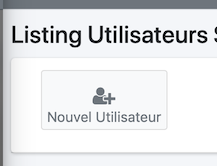
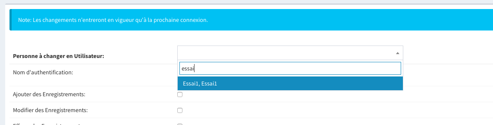

Un utilisateur a les droits suivants

* gérer son espace personnel
* accéder à son dossier via WebDAV
* Ajouter des fichiers dans son espace personnel
* Créer des calendriers
* Consulter des calendriers partagés
* Partager ses calendriers

## Pour accéder à la gestion

3. Pour gérer les utilisateurs
	* Aller dans la partie réglage

		

	* Puis dans "Utilisateurs du Système"

		

	* On peut maintenant gérer les utilisateurs ou en créer

		

2. Pour modifier un utilisateur

	

3. Créer un utilisateur d'une personne

	

	

## Pour modifier les propriétés

1. Droits d'un utilisateur (pour un administrateur du système)

	*  Il peut gérer un des aspects les plus puissant le panier
	*  les enregistrements (Créer des Personnes)
	*  Modidier des personnes
	*  Visualiser les cartes google map pour voir les personnes
	*  Administrer des Propriétés et Classifications:
	*  Administrer des Groupes et des Rôles:
	*  Administrer des Cotisations et des Finances:
	*  Visualiser, Ajouter et Modifier les documents:
	*  Modifier son propre compte:	 (Modifier uniquement sa propre famille.)
	*  Démarcheur:	 (bénévolat pour du démarchage.)
	*  Créer des administrateur Administrateur
	*  Gérer les couleurs par défaut du CRM

2. Il peut également fixer les droits auquel chaque utilisateur a accès
	+ Envoyer des mails
	+ Gérer son caractères de séparation pour les mails groupés
	+ Créer des Annuaires de personnes
	+ Exporter le contenu d'un panier au format CSV (sous Excel ou LibreOffice Calc)
	+ Afficher des bulles d'aide
	+ Ajouter des événements dans le calendrier
	+ Voir les données privées
