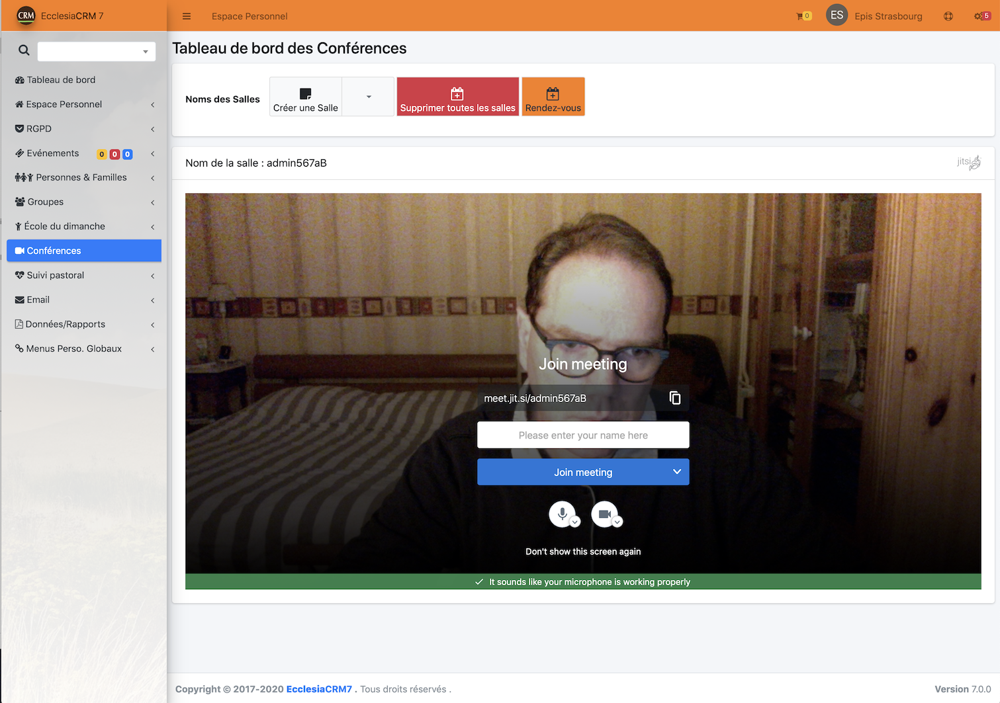

Depuis la version 7.0 d'EcclesiaCRM, il est possible de faire de la visio conférence via Jitsi

Vous pourrez créer

- des salles de réunion
- travailler à plusieurs
- échanger des fichiers
- partager votre écran
- un chat est intégré
