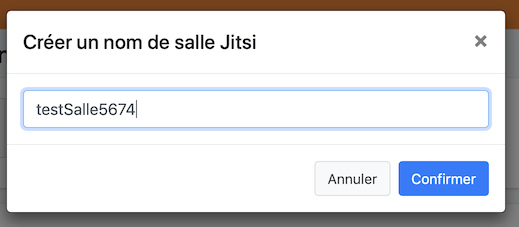
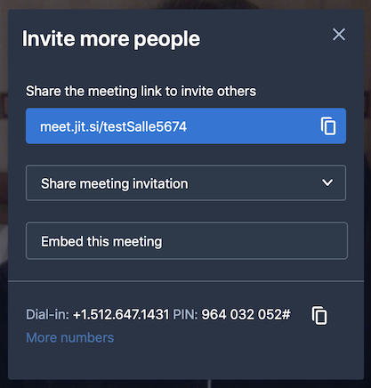

##Create a meeting

Use the button below

You get this window, choose a name (avoid the spaces, underscore special char, etc ...)

Set now your name or nickname

And ... it is done

##Invite other people

Click the blue button

- copy the share meeting link
- and paste it to a mail

It's done

##Meetings management

>Note : you can prepare several meetings and switch from one to another.

To do this, use the arrow button

##Last

You can delete all your rooms or create an appointment in the calendar....

