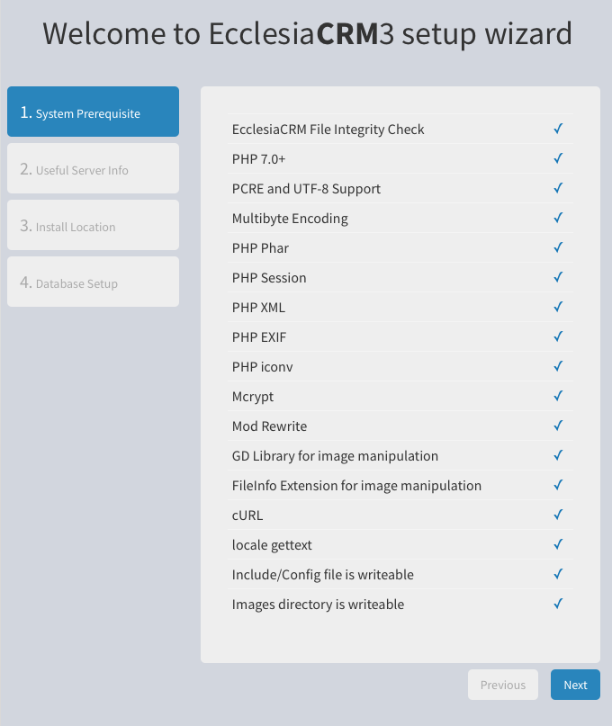
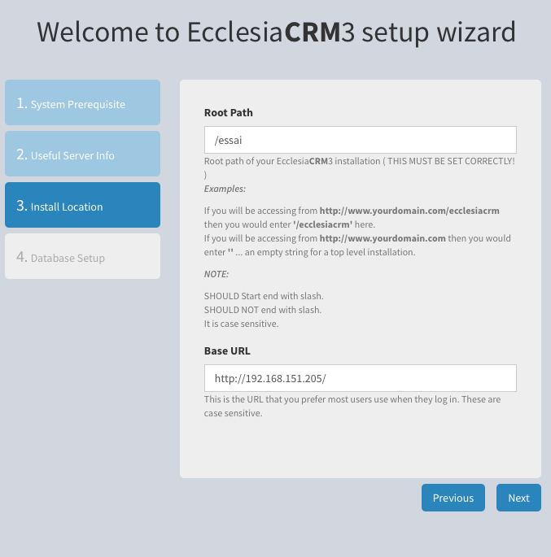
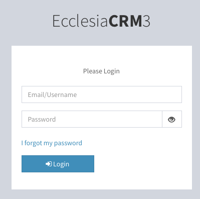

## Installation
* Vous téléchargez l'archive sur git.
* vous copiez ensuite les fichiers sur le serveur.
* Vous vous laissez guider par l'installeur.

  
  
* Puis on continue

  
  
* Et on termine

  
  
* On tombe sur l'écran d'accueil

  
  
  Le login est        : admin
  Le mot de passe est : changeme
  
* Vous serez invité à changer votre mot de passe tout de suite.
