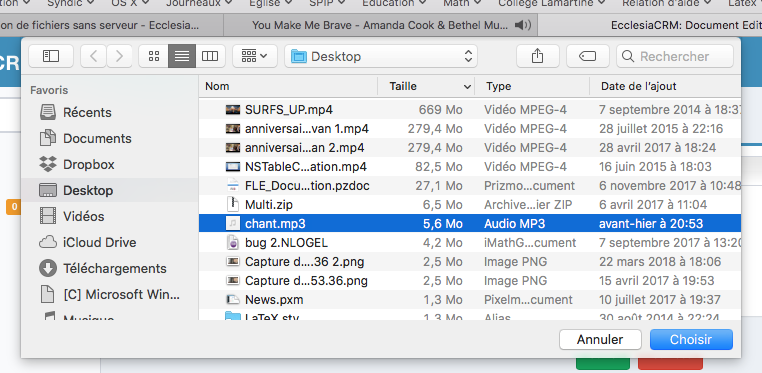

## Introduction

Depuis la version 3.5.0, il est possible de gérer les fichiers des membres dans Ecclesia**CRM**.

Pour cela, il faut transformer une personne en utilisateur du système. Consultez la section "Gestion des utilisateurs di **CRM**".

Une fois un utilisateur créé, vous pourrez vous connecter au serveur WebDAV.
L'utilisation suivante peut se faire avec un hébergeur normal.

## Gestion des fichiers

1. Dans la partie "Profile Utilisateur"
	- Il suffit de se rendre dans son profile personnel
	
	
	
	- On ajoute un document
	
	

	- On choisit le type
	
	
	
	- il est possible de télécharger un document qui se trouvera sur votre bureau ou tout autre localisation
	
	
	
	On peut maintenant enregistrer le document  et le stocker dans son espace personnel.
	
	

2. Pour y accéder

	- Quand l'ensemble est terminé, on retrouve dans le Time Line 
	
	

	- Et dans la partie "Documents"
	
	
	

**Remarque** Vous remarquerez un petit lecteur pour tout fichier audio ou vidéo.

Pour un fichier pdf vous aurez une liseuse permettant de bien le visualiser.

