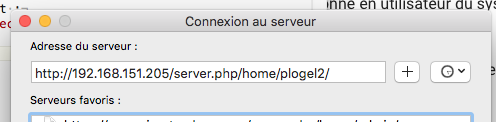
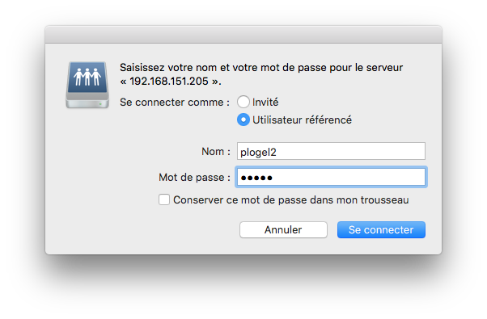

## Introduction

Avec la version 3.5.0 et plus, il est possible de gérer les fichiers des membres dans Ecclesia**CRM**.

Il faut transformer une personne en utilisateur du CRM. Consultez la section "Gestion des utilisateurs di **CRM**".

Une fois un utilisateur créé, vous pourrez vous connecter au serveur WebDAV.
** ATTENTION ** votre hébergeur doit être compatible WebDAV.

## Sous MacOS

  * dans le "Finder", sélectionnez le menu suivant :
  
  
  
  * Choisir l'item "Se connecter au serveur...."
  
  * Il faudra ensuite saisir l'adresse sous la forme : **https://url_serveur/server.php/home/nom_utilisateur/**
  
  
  
  * Renseignez l'identifiant de l'utilisateur
  
  Evitez de cocher la case pour vous souvenir du mot de passe.
  
  
  
  * Une fenêtre s'ouvrira sur le dossier de partage
  
  
  
## Sous Windows

  - Dans l'explorateur de fichiers, faîtes un clic droit sur l'icône réseau
  
  
  
  - Il faudra ensuite saisir l'adresse sous la forme : **https://url_serveur/server.php/home/nom_utilisateur/**
  
  

  - Renseignez l'identifiant de l'utilisateur, en cochant les deux cases 
  
  
  
  - Une fenêtre s'ouvrira sur le dossier de partage

  
  

Il est possible maintenant d'ajouter les documents que vous voulez dans ce dossier et ils se retrouveront dans profile utilisateur.

Un fichier rajouté via ce moyen aura une mention DAV :

